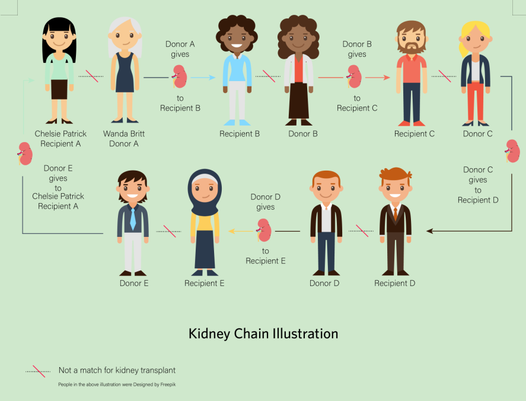

   
# Kidney Exchange Program 

## What is a living donor kidney exchange problem?

Let's say a person wants to donate his/her kidney to a loved one but cannot do so because they have some medical incompatibility. This problem can be solved by curating similar patients and swapping the kidney within themselves. This problem is called the living donor kidney exchange problem, and in most places of India, doctors solve it manually. 

## Aim

This project aims to automate a part of this process. This project's primary focus is to provide a platform to facilitate automized inter-hospital kidney transplants.

## Features

This platform allows interested hospitals to register. The doctors from the registered hospitals can create their accounts and add their patients' (having kidney problems) medical details to this platform.

After a doctor completes this process, this platform provides two main features. The first feature is an option to view only the essential details of a patient required for a kidney transplant. Second, for a given patient, all suitable matches from all the registered hospitals are displayed. These suitable matches are ranked from best to worst.

## Setting up this project 

### Method 1 (Manual setup)
This method is recommended if you are working on the backend of this project.

Explained in this [document](https://www.notion.so/Project-setup-Public-1a647ed8515c485f99f38e717acfa61b)

### Method 2 (Through Docker)
This method will be sufficient if you are working only on the frontend of this project. 

How to run the server (Optional)

1. Install Docker
2. Run `docker-compose up` inside the project root folder

Done! Now you should be able to access the project at **0.0.0.0:8080** or **localhost:8080**. And you should just refresh the page to see your changes.

## Contributing Guidlines

- Please follow the rules mention in the [contributor's document](https://github.com/siv2r/kidney-exchange/blob/master/CONTRIBUTING.md) while contributing to this project.
- Slack group: [Join here](https://join.slack.com/t/kidney-exchange/shared_invite/zt-n54e89o7-yB5E6eZl7q3DAvLFdUAwgA) (*Note:* This group was started recently so, please be patient).
- [How to create a pull request?](https://github.com/siv2r/kidney-exchange/blob/master/CreatePR.md)

## Contributors
This project is possible due to these amazing people✨✨

<table>
	<tr>
		<td>
			
		</td>
	</tr>
</table>

