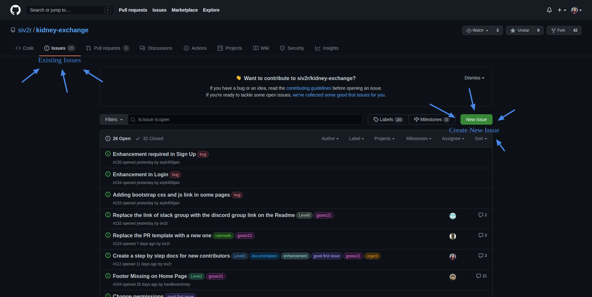
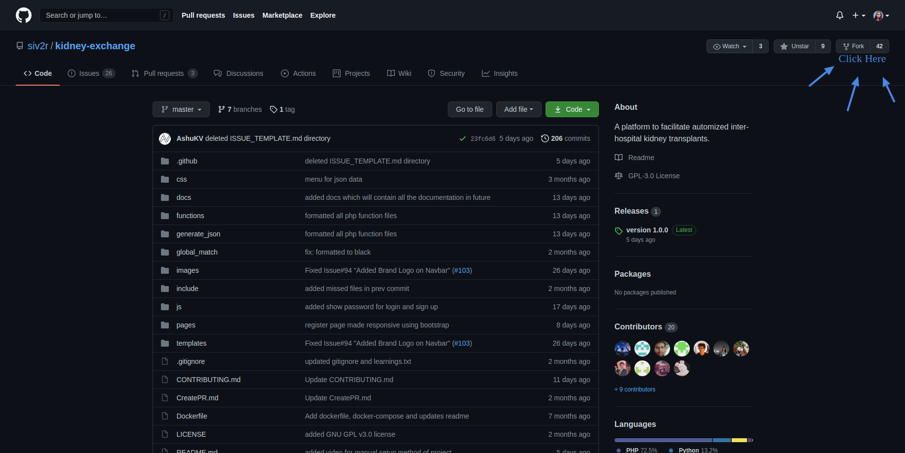
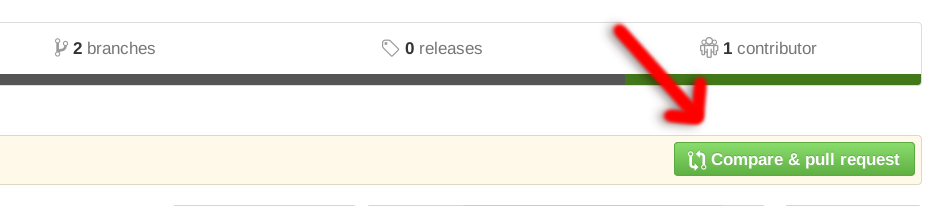

<h1 align="center">Hello Peeps 👋</h1>
<h2 align="center">Welcome to the <a href="https://github.com/siv2r/kidney-exchange">kidney-exchange</a> Repo 🎉</h2>

<h2 align="center">Here, is the Complete Guide to Contribute to this Repo.</h2>

 1.  Firstly, Join our [Discord](https://discord.com/invite/d7j63WZV82) Server, Introduce yourself there, Interact with Others as 
      > **Open Source is more about Collaboration.** 

    

 2.  So to start Contributing to our Project you can solve existing issues or if you have found any bugs or want to add a new feature to Project you can create New Issue, that's purely your choice.

  

 3.  Project Maintainers and Mentors will guide you with the issue and incase of any problem you face, you can take help from the community in the discord server.

 4.  So, Now you have an issue to work upon. So first you need is to fork Repo. "*Fork means producing a Personal Copy of Someone else's Project*". You can fork Repo This Way:-

  

 5.  Clone the Repo you have forked:-

  
      - Copy the link of the forked Repo.
      
      - Go to the desired location in the terminal, where you want to place the project.
      
      - Run command ``git clone link_of_forked_repo``.
      
      - Run Command ``cd kidney-exchange ``.
      
      - Open the folder with your favorite text editor command.

 6.  Set upstream to the Repo Using Command  `` git remote add upstream https://github.com/siv2r/kidney-exchange``.
  

 7.  Make a branch using the command  ``git checkout -b branch_name ``.

 8.  Now it is the time to make required changes in the project 🌸

 9.  When you are done with the changes Run the following Commands:-

  
      - ``git add .``
      
      - `` git commit -m"any_message_related_to_what_u_hv_done"``
      
      - ``git push origin branch_name``

 10.  Go to your forked Repo in Github, there you will see a notification for Compare and Pull Request like this:-

   
  Click this and create your First Pull Request.

 11.  Mentors will review your changes and will give feedback and if everything go well, your PR will get merged, Hurray  🎉🥳

 12.  So Now your PR Got Merged 🎉, Again Find or Create Issue and Continue the loop of Contributions to this Project

<h1 align="center"> Happy Coding 💻</h1>
  

  